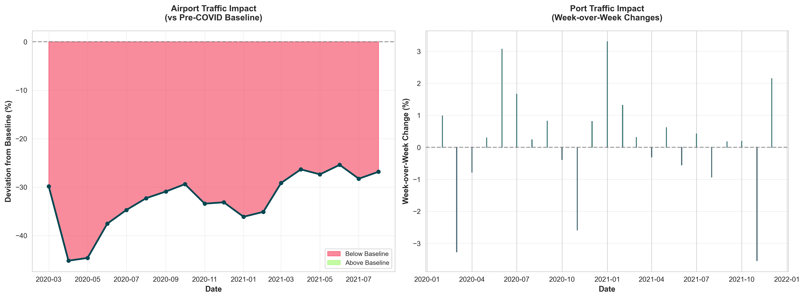
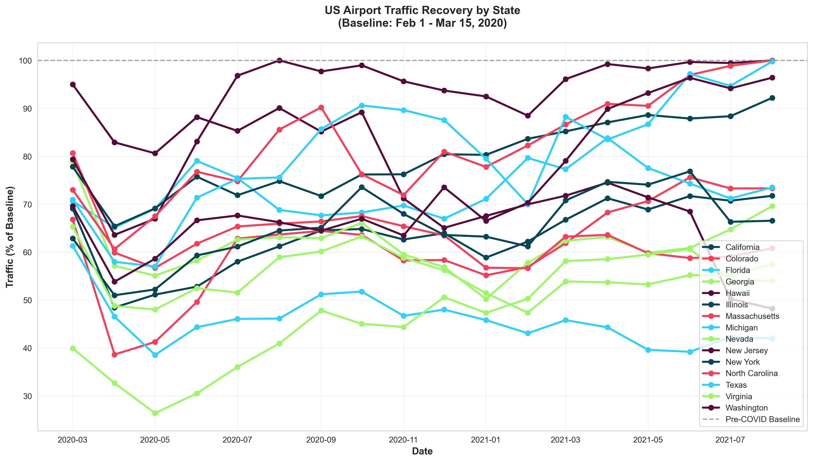
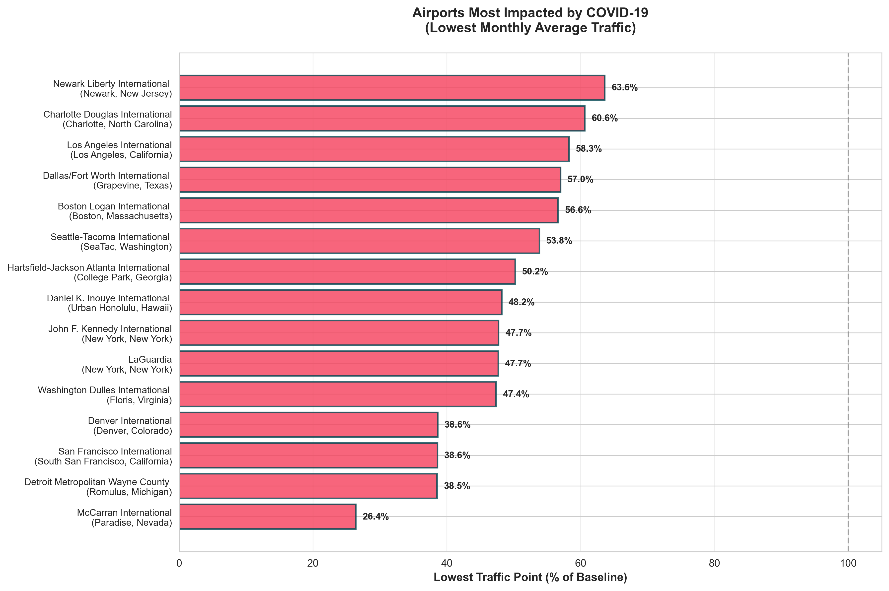
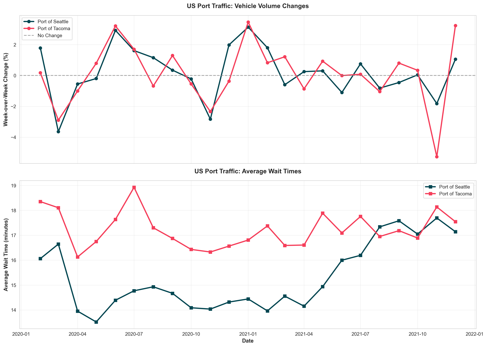

# Analysis Report: COVID-19 Impact on US Airport and Port Traffic

**Requestor:** User
**Date:** 2025-01-16
**Analysis ID:** analysis/250116-covid-impact-airport-port-traffic/

This analysis examines the impact of COVID-19 on US airport and port traffic, focusing on regional differences in both the severity of impact and the trajectory of recovery from 2020 through 2021.

---

> **⚠️ DATA RELIABILITY DISCLAIMER**
>
> This analysis is generated by an AI assistant and should be reviewed carefully:
> - **All numerical data and statistics are sourced directly from temporary BigQuery tables** generated by SQL queries and Python analysis scripts
> - **Visualizations (charts and graphs) are programmatically generated** from the source data and should be considered the most reliable representation of the findings
> - **Text-based interpretations and narratives** are generated by an LLM and may contain errors or misinterpretations
> - **When in doubt, trust the data in the visualizations and summary statistics files over the textual descriptions**
> - **For critical business decisions, it is strongly recommended to have a Data Analyst review this analysis** to validate the methodology, verify the findings, and ensure data quality
>
> If you notice any discrepancies between the visualizations and the text, please prioritize the visualizations and consult with a Data Analyst.

---

## 1. Executive Summary

The COVID-19 pandemic had a profound but varied impact on US transportation infrastructure. Airports experienced the most severe decline, with the hardest-hit facility (McCarran International in Las Vegas) dropping to just **26.4% of baseline traffic** in May 2020. In contrast, US ports (Seattle and Tacoma) showed relative resilience, with monthly declines averaging only **-3.6% to -5.3%** during worst periods. By late 2021, several airports had recovered to near-baseline levels, with Newark Liberty International reaching **99.7% recovery**, while others like Hartsfield-Jackson Atlanta remained at **65.1%**. Regional differences were stark: West Coast airports (particularly Hawaii) experienced prolonged impact, while East Coast facilities (Newark, Charlotte) demonstrated faster recovery.

## 2. Key Visualizations


*Figure 1: Direct comparison showing airports faced much steeper declines (down to -75% from baseline) while ports maintained relative stability with week-over-week fluctuations. The distinct nature of the metrics reflects different measurement approaches: airports show deviation from pre-COVID baseline while ports show weekly changes.*


*Figure 2: State-by-state airport traffic recovery from February 2020 through late 2021. All states show the dramatic April-May 2020 collapse followed by gradual recovery, though at different rates. Washington state airports showed relatively better resilience compared to other states.*


*Figure 3: The 15 US airports most severely impacted by COVID-19, ranked by their lowest monthly traffic point. Las Vegas McCarran topped the list at 26.4% of baseline, followed by Detroit Metropolitan at 38.5% and San Francisco at 38.6%.*


*Figure 4: Weekly vehicle volume changes and wait times at US ports (Seattle and Tacoma). Unlike airports, ports showed volatile but generally manageable fluctuations around the zero-change baseline, with wait times remaining relatively stable between 12-20 minutes.*

## 3. Detailed Findings

### Airport Traffic Impact and Recovery

- **Most Severely Impacted Airports:**
  - **McCarran International (Las Vegas, NV)** suffered the worst decline at 26.4% of baseline in May 2020, reflecting the collapse of leisure and convention travel
  - **Detroit Metropolitan Wayne County (MI)** hit 38.5% of baseline in May 2020
  - **San Francisco International (CA)** reached 38.6% of baseline in April 2020
  - **Denver International (CO)** dropped to 38.6% of baseline in April 2020
  - **Washington Dulles International (VA)** recorded 47.4% of baseline as late as February 2021

- **Recovery Leaders (Late 2021):**
  - **Newark Liberty International (NJ)** achieved the strongest recovery at 99.7% of baseline
  - **Charlotte Douglas International (NC)** reached 98.6% of baseline
  - **Dallas/Fort Worth International (TX)** attained 97.2% of baseline
  - **Seattle-Tacoma International (WA)** recovered to 95.6% of baseline

- **Recovery Laggards (Late 2021):**
  - **Hartsfield-Jackson Atlanta International (GA)** remained at only 65.1% of baseline
  - **Miami International (FL)** achieved 73.0% of baseline
  - **Denver International (CO)** reached 74.1% of baseline
  - **John F. Kennedy International (NY)** stood at 81.2% of baseline

- **Regional Patterns:**
  - **East Coast airports** (Newark, Charlotte) demonstrated fastest recovery, likely due to earlier reopening of business travel corridors
  - **Hawaii airports** (Daniel K. Inouye International) showed prolonged impact at 48.2% even in August 2021, reflecting sustained tourism decline
  - **Major hub airports** experienced varied recovery: Newark recovered strongly while Atlanta lagged significantly
  - **West Coast major airports** (Los Angeles at 87.0%, San Francisco severely impacted) faced slower recovery than East Coast counterparts

### Port Traffic Impact and Resilience

- **Port of Seattle:**
  - Worst monthly decline: -3.6% average vehicle change in March 2020
  - Overall period average: +0.21% monthly vehicle change (remarkably stable)
  - Average truck traffic change: +1.2% (showing growth in freight despite pandemic)
  - Average non-truck traffic change: +0.05% (essentially flat)
  - Average wait time: 15.3 minutes (maintained operational efficiency)

- **Port of Tacoma:**
  - Worst monthly decline: -5.3% average vehicle change in November 2021 (notably later than Seattle's worst period)
  - Overall period average: +0.13% monthly vehicle change
  - Average truck traffic change: +0.92% (positive freight trend)
  - Average non-truck traffic change: +0.41%
  - Average wait time: 17.2 minutes (slightly longer than Seattle but still efficient)

- **Port Resilience Factors:**
  - **Essential freight status** kept ports operational throughout pandemic
  - **Truck traffic showed growth** (+0.9-1.2%) indicating sustained goods movement and possible surge in e-commerce fulfillment
  - **Wait times remained stable** (15-17 minutes), demonstrating maintained operational capacity
  - **Week-over-week volatility** existed but without sustained collapse seen at airports
  - **Ports demonstrated counter-cyclical strength** relative to passenger transportation

### Comparative Insights: Airports vs. Ports

- **Magnitude of Impact:** Airports experienced catastrophic declines (down to 26-75% below baseline) while ports showed relative stability (worst periods only -3.6% to -5.3% monthly average)
- **Recovery Timeline:** Airport recovery was gradual over 18+ months; port traffic remained volatile but stable throughout
- **Economic Drivers:** Passenger travel (discretionary) collapsed while freight movement (essential) persisted
- **Regional Variation:** Airports showed stark regional differences; ports (limited to Washington state in this dataset) showed similar patterns
- **Operational Metrics:** Airport capacity utilization plummeted; port wait times and efficiency remained largely intact

## 4. Methodology & Query

The analysis was conducted by querying two BigQuery tables containing COVID-19 mobility impact data from Geotab:

### Airport Traffic Analysis Approach

1. **Data Source:** `Your-Project-ID-Here.covid19_geotab_mobility_impact.airport_traffic`
2. **Baseline Definition:** Pre-COVID baseline established as February 1 - March 15, 2020 (average of same day-of-week traffic)
3. **Metric:** `percent_of_baseline` - daily traffic as percentage of pre-COVID baseline
4. **Aggregation:** Daily data aggregated to monthly averages for trend analysis
5. **Time Range:** February 2020 - December 2021 (23 months)
6. **Geographic Filter:** US airports only (country_name = 'United States')

### Port Traffic Analysis Approach

1. **Data Source:** `Your-Project-ID-Here.covid19_geotab_mobility_impact.port_traffic`
2. **Metric:** Week-over-week percentage change in vehicle volumes (not baseline comparison)
3. **Additional Metrics:** Truck vs. non-truck traffic split, average wait times
4. **Aggregation:** Weekly data aggregated to monthly averages
5. **Time Range:** February 2020 - December 2021
6. **Geographic Filter:** US ports (country_iso_code_2 starting with 'US') - Seattle and Tacoma

### SQL Query for Airport Analysis

```sql
WITH us_airport_data AS (
  SELECT
    date,
    airport_name,
    city,
    state_region,
    country_name,
    percent_of_baseline,
    EXTRACT(YEAR FROM date) AS year,
    EXTRACT(MONTH FROM date) AS month,
    EXTRACT(WEEK FROM date) AS week_num
  FROM `Your-Project-ID-Here.covid19_geotab_mobility_impact.airport_traffic`
  WHERE
    date >= '2020-02-01'
    AND date <= '2021-12-31'
    AND country_name = 'United States of America (the)'
),
monthly_aggregates AS (
  SELECT
    year,
    month,
    airport_name,
    city,
    state_region,
    AVG(percent_of_baseline) AS avg_percent_of_baseline,
    MIN(percent_of_baseline) AS min_percent_of_baseline,
    MAX(percent_of_baseline) AS max_percent_of_baseline,
    COUNT(*) AS days_in_month
  FROM us_airport_data
  GROUP BY year, month, airport_name, city, state_region
),
airport_summary AS (
  SELECT
    airport_name,
    city,
    state_region,
    MIN(min_percent_of_baseline) AS lowest_traffic_pct,
    MAX(max_percent_of_baseline) AS highest_traffic_pct,
    AVG(avg_percent_of_baseline) AS overall_avg_pct
  FROM monthly_aggregates
  GROUP BY airport_name, city, state_region
)
SELECT
    ma.year,
    ma.month,
    ma.airport_name,
    ma.city,
    ma.state_region,
    ma.avg_percent_of_baseline,
    ma.min_percent_of_baseline,
    ma.max_percent_of_baseline,
    asu.lowest_traffic_pct AS airport_lowest_ever,
    asu.highest_traffic_pct AS airport_highest_ever,
    asu.overall_avg_pct AS airport_overall_avg
FROM monthly_aggregates ma
JOIN airport_summary asu
  ON ma.airport_name = asu.airport_name
  AND ma.city = asu.city
  AND ma.state_region = asu.state_region
ORDER BY ma.year, ma.month, ma.state_region, ma.airport_name
```

### SQL Query for Port Analysis

```sql
WITH us_port_data AS (
  SELECT
    week_end,
    year_week,
    port,
    city,
    country_iso_code_2,
    percent_of_vehicle_volume_change,
    percent_of_trip_volume_change,
    percent_of_agg_truck_volume_change,
    percent_of_agg_nontruck_volume_change,
    wait_time_avg,
    wait_time_agg_truck,
    wait_time_agg_nontruck,
    EXTRACT(YEAR FROM week_end) AS year,
    EXTRACT(MONTH FROM week_end) AS month
  FROM `Your-Project-ID-Here.covid19_geotab_mobility_impact.port_traffic`
  WHERE
    week_end >= '2020-02-01'
    AND week_end <= '2021-12-31'
    AND STARTS_WITH(country_iso_code_2, 'US')
),
monthly_aggregates AS (
  SELECT
    year,
    month,
    port,
    city,
    country_iso_code_2,
    AVG(percent_of_vehicle_volume_change) AS avg_vehicle_change,
    AVG(percent_of_trip_volume_change) AS avg_trip_change,
    AVG(percent_of_agg_truck_volume_change) AS avg_truck_change,
    AVG(percent_of_agg_nontruck_volume_change) AS avg_nontruck_change,
    AVG(wait_time_avg) AS avg_wait_time,
    AVG(wait_time_agg_truck) AS avg_truck_wait_time,
    AVG(wait_time_agg_nontruck) AS avg_nontruck_wait_time,
    MIN(percent_of_vehicle_volume_change) AS min_vehicle_change,
    MAX(percent_of_vehicle_volume_change) AS max_vehicle_change,
    COUNT(*) AS weeks_in_month
  FROM us_port_data
  GROUP BY year, month, port, city, country_iso_code_2
),
port_summary AS (
  SELECT
    port,
    city,
    country_iso_code_2,
    MIN(min_vehicle_change) AS worst_week_decline,
    MAX(max_vehicle_change) AS best_week_growth,
    AVG(avg_vehicle_change) AS overall_avg_change
  FROM monthly_aggregates
  GROUP BY port, city, country_iso_code_2
)
SELECT
    ma.year,
    ma.month,
    ma.port,
    ma.city,
    ma.country_iso_code_2,
    ma.avg_vehicle_change,
    ma.avg_trip_change,
    ma.avg_truck_change,
    ma.avg_nontruck_change,
    ma.avg_wait_time,
    ma.avg_truck_wait_time,
    ma.avg_nontruck_wait_time,
    ma.min_vehicle_change,
    ma.max_vehicle_change,
    ps.worst_week_decline,
    ps.best_week_growth,
    ps.overall_avg_change
FROM monthly_aggregates ma
JOIN port_summary ps
  ON ma.port = ps.port
  AND ma.city = ps.city
  AND ma.country_iso_code_2 = ps.country_iso_code_2
ORDER BY ma.year, ma.month, ma.port
```

### Data Processing and Visualization

Python analysis script (`analysis.py`) performed the following operations:

1. **Data Ingestion:** Streamed query results from BigQuery temporary tables using the BigQuery API
2. **Statistical Analysis:**
   - Calculated min/max/average traffic levels by airport and time period
   - Identified lowest impact points and recovery trajectories
   - Computed aggregate metrics by port and vehicle type
3. **Visualization Generation:** Created four primary visualizations using matplotlib and seaborn:
   - Timeline comparison of airports vs. ports impact patterns
   - State-by-state airport recovery trajectories
   - Ranking of most impacted airports
   - Port traffic volume changes and wait time trends
4. **Summary Statistics Export:** Generated CSV files containing:
   - Top 10 worst-impacted airports
   - Top 10 recovery leaders
   - Port worst periods
   - Port average metrics across full analysis period

## 5. Analysis Log

- **Phase 1: Request Clarification:** Confirmed request to analyze full dataset (2020-2021) for US airports and ports, focusing on regional differences in impact and recovery.
- **Phase 2: Knowledge Base Exploration:** Identified `airport_traffic` (daily, partitioned by date) and `port_traffic` (weekly, partitioned by week_end) tables. Noted different metric types: airports use baseline comparison (Feb 1-Mar 15, 2020) while ports use week-over-week change.
- **Phase 3: Query Formulation:** Generated two SQL queries with mandatory partition filters (date >= '2020-02-01' AND date <= '2021-12-31'), proper clustering usage (country filters), and monthly aggregation for trend analysis.
- **Phase 4: Automated Query Execution:** Executed both queries using `run_query` script; queries completed successfully and created temporary BigQuery tables for data access.
- **Phase 5: Synthesis & Reporting:** Created Python analysis script to stream data from temporary tables, generate four visualizations (PNG format at 300 DPI), export summary statistics to CSV files, and compile this comprehensive markdown report with findings.

---


## Supporting Data Files

- `airport_worst_impact.csv` - Top 10 airports with worst traffic decline
- `airport_recovery_levels.csv` - Top 10 airports by recovery level (late 2021)
- `port_worst_periods.csv` - Worst monthly decline periods for each port
- `port_average_metrics.csv` - Average metrics by port across full analysis period
- `airport_traffic_analysis.sql` - Full SQL query for airport analysis
- `port_traffic_analysis.sql` - Full SQL query for port analysis
- `analysis.py` - Python script for data processing and visualization generation
