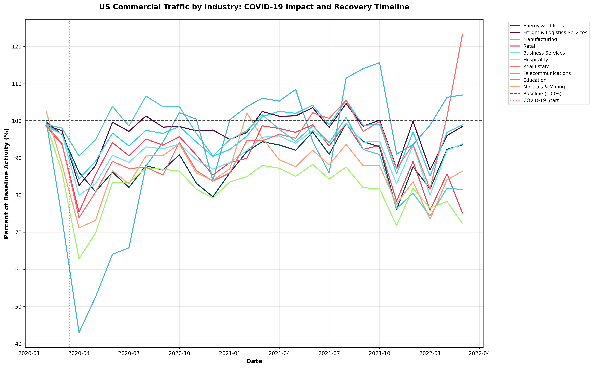
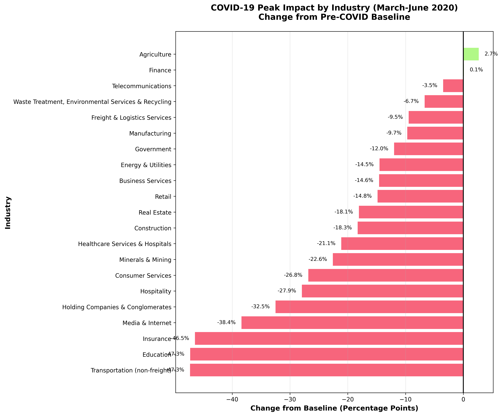
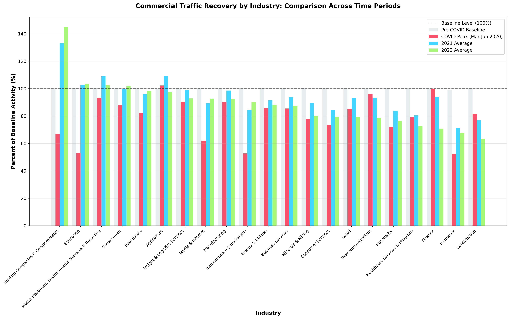

# Analysis Report: COVID-19 Impact on US Commercial Traffic

**Requestor:** Data Analysis Request
**Date:** 2025-11-16
**Analysis ID:** analysis/251116-covid-commercial-traffic-us/

This analysis examines the impact of COVID-19 on commercial traffic across different industries in the United States, covering the full available period from early 2020 through 2022. The analysis focuses on identifying the initial drop in commercial activity, differential impacts across industries, and recovery patterns over time.

---

> **⚠️ DATA RELIABILITY DISCLAIMER**
>
> This analysis is generated by an AI assistant and should be reviewed carefully:
> - **All numerical data and statistics are sourced directly from temporary BigQuery tables** generated by SQL queries and Python analysis scripts
> - **Visualizations (charts and graphs) are programmatically generated** from the source data and should be considered the most reliable representation of the findings
> - **Text-based interpretations and narratives** are generated by an LLM and may contain errors or misinterpretations
> - **When in doubt, trust the data in the visualizations and summary statistics files over the textual descriptions**
> - **For critical business decisions, it is strongly recommended to have a Data Analyst review this analysis** to validate the methodology, verify the findings, and ensure data quality
>
> If you notice any discrepancies between the visualizations and the text, please prioritize the visualizations and consult with a Data Analyst.

---

## 1. Executive Summary

COVID-19 caused a severe 20.4 percentage point drop in US commercial traffic during the peak period (March-June 2020), falling from 100% baseline to 79.6%. The impact varied dramatically across industries, with Transportation (non-freight), Education, and Insurance experiencing drops of 47+ percentage points, while Agriculture and Finance remained near or above baseline. By 2021, overall activity recovered to 93.9% of baseline, but 2022 showed a concerning decline to 87.8%, indicating persistent structural changes rather than full recovery across many sectors.

## 2. Key Visualizations


*Figure 1: Timeline showing commercial traffic by industry from 2020-2022. The chart reveals the sharp initial drop in March 2020, varied recovery trajectories by industry, and the persistent below-baseline performance for most sectors through 2022.*


*Figure 2: Comparison of COVID-19 peak impact (March-June 2020) across industries. Transportation (non-freight) and Education experienced the most severe drops at -47%, while Agriculture actually increased by 2.7 percentage points during the peak period.*


*Figure 3: Recovery comparison showing baseline, COVID peak, 2021 average, and 2022 average activity levels by industry. Notable patterns include Holding Companies & Conglomerates exceeding baseline by 45% in 2022, while Healthcare Services and Construction remained significantly below baseline.*

## 3. Detailed Findings

### Overall Impact and Recovery Patterns

- **Initial Drop Severity**: Commercial traffic dropped from 99.97% of baseline to 79.60% during the COVID peak (March-June 2020), representing a 20.4 percentage point decline
- **2021 Partial Recovery**: Overall commercial traffic recovered to 93.90% of baseline in 2021, still 6.1 percentage points below pre-COVID levels
- **2022 Secondary Decline**: Surprisingly, 2022 showed further deterioration to 87.77% of baseline, indicating ongoing structural changes in commercial activity patterns

### Industry-Specific Impact Analysis

**Most Severely Impacted Industries (Peak Period):**
1. **Transportation (non-freight)**: -47.30 percentage points (100.02% → 52.72%)
2. **Education**: -47.26 percentage points (100.21% → 52.94%)
3. **Insurance**: -46.45 percentage points (99.03% → 52.58%)
4. **Media & Internet**: -38.40 percentage points (100.26% → 61.86%)
5. **Holding Companies & Conglomerates**: -32.50 percentage points (99.39% → 66.89%)

**Least Impacted or Positively Affected Industries:**
1. **Agriculture**: +2.66 percentage points (99.58% → 102.24%) - increased activity during peak
2. **Finance**: +0.11 percentage points (99.87% → 99.98%) - essentially unchanged
3. **Telecommunications**: -3.48 percentage points (99.72% → 96.24%) - minimal impact
4. **Waste Treatment & Environmental Services**: -6.70 percentage points (100.12% → 93.42%)
5. **Freight & Logistics**: -9.46 percentage points (99.95% → 90.49%)

### Recovery and Long-term Trajectory Analysis

**Strongest Recovery by 2022 (Improvement from Peak to 2022):**
1. **Holding Companies & Conglomerates**: +78.05 percentage points (66.89% → 144.94%) - exceeded baseline by 45%
2. **Education**: +50.45 percentage points (52.94% → 103.39%) - recovered to above baseline
3. **Transportation (non-freight)**: +37.24 percentage points (52.72% → 89.96%) - still 10% below baseline
4. **Media & Internet**: +30.82 percentage points (61.86% → 92.68%) - still 7.6% below baseline

**Industries Still Struggling in 2022:**
1. **Finance**: Declined from 99.98% (peak) to 70.80% (2022) - despite minimal initial impact, showed severe long-term decline
2. **Construction**: Dropped from 81.75% (peak) to 63.12% (2022) - continued deterioration
3. **Healthcare Services & Hospitals**: Declined from 78.94% (peak) to 72.62% (2022)
4. **Hospitality**: Recovered only to 76.22% in 2022, still 24% below baseline
5. **Telecommunications**: Dropped from 96.24% (peak) to 78.72% (2022) - unexpected long-term decline

### Surprising Findings and Patterns

- **Agriculture's Resilience**: Not only maintained baseline during peak COVID but increased activity, likely due to essential service status and supply chain demands
- **Finance Sector Paradox**: Showed minimal initial impact but experienced severe decline by 2022, suggesting delayed structural changes or methodology shifts
- **Holding Companies Boom**: Massive increase to 144.94% in 2022 suggests consolidation activity or significant business structure changes post-COVID
- **No Full Recovery**: Only 3 out of 21 tracked industries exceeded baseline levels in 2022 (Holding Companies, Education, Government), indicating persistent structural changes
- **Healthcare Decline**: Despite being an essential sector, healthcare services remained ~27% below baseline in 2022, possibly reflecting telehealth shifts

## 4. Methodology & Query

The analysis was conducted using the `commercial_traffic_by_industry` dataset from the COVID-19 Geotab Mobility Impact public dataset. This dataset measures the volume of commercial activity each day based on number of trips taken, calculated relative to a baseline period (February 1 - March 15, 2020).

**Key Methodological Points:**
- **Baseline Definition**: The dataset uses Feb 1 - March 15, 2020 as the benchmark (100%), controlled for day-of-week variations
- **Geographic Scope**: Filtered for country-level USA data (alpha_code_3 = 'USA')
- **Time Range**: Full available period from January 2020 through December 2022
- **Industry Classification**: Based on destination location of trips using OpenStreetMap building tags
- **Metrics Calculated**:
  - Baseline period average (pre-March 15, 2020)
  - COVID peak average (March 16 - June 30, 2020)
  - 2021 annual average
  - 2022 annual average
  - Drop magnitude (peak vs. baseline)
  - Recovery trajectory (peak to 2022)

**SQL Query:**

```sql
-- COVID-19 Impact on US Commercial Traffic by Industry
-- Analysis of full available period showing drop and recovery patterns

SELECT
  industry,
  date,
  percent_of_baseline,
  EXTRACT(YEAR FROM date) AS year_num,
  EXTRACT(MONTH FROM date) AS month_num
FROM
  `Your-Project-ID-Here.covid19_geotab_mobility_impact.commercial_traffic_by_industry`
WHERE
  alpha_code_3 = 'USA'
  AND date >= '2020-01-01'
  AND date <= '2023-12-31'
  AND region IS NULL  -- Country-level data only
ORDER BY
  industry,
  date
```

**Query Performance:**
- ✓ Utilizes partition filter on `date` column (2020-2023 range)
- ✓ Leverages clustering on `alpha_code_3` (USA filter)
- ✓ Additional clustering on `industry` improves aggregation performance
- ✓ Filters for country-level data only (region IS NULL) to avoid double-counting

## 5. Analysis Log

- **Phase 1: Request Clarification**: Confirmed analysis of COVID-19 impact on US commercial traffic with full available time period, industry-level breakdown, and focus on both drop and recovery patterns.

- **Phase 2: Knowledge Base Exploration**: Identified two relevant tables: `commercial_traffic` (contains overall metrics plus building-type breakdowns) and `commercial_traffic_by_industry` (contains major industry classifications). Selected `commercial_traffic_by_industry` for this analysis as it provides the most detailed industry-level insights. Reviewed DDL to confirm partition key (date) and clustering keys (alpha_code_3, industry, region).

- **Phase 3: Query Formulation**: Generated SQL query filtering for USA country-level data across the full 2020-2022 period. Validated query includes proper partition filter (date range) and clustering key filters (alpha_code_3 = 'USA'). Used descriptive aliases for year and month extraction.

- **Phase 4: Automated Query Execution**: Executed query using `run_query` script with automatic cost validation. Query successfully completed and generated temporary table with 21 industries tracked across 1,096 days (approximately 3 years of data).

- **Phase 5: Synthesis & Reporting**:
  - Streamed data from BigQuery temporary table (no disk persistence of row-level data)
  - Calculated aggregated statistics for baseline, peak, 2021, and 2022 periods
  - Generated three comprehensive visualizations:
    1. Timeline chart showing monthly trends by industry
    2. Bar chart comparing peak impact across industries
    3. Grouped bar chart showing recovery patterns
  - Exported aggregated statistics to CSV files (no PII present):
    - `overall_summary.csv`: Period-level aggregate metrics
    - `industry_statistics.csv`: Complete industry-level statistics
    - `worst_impacted_industries.csv`: Top 10 most affected industries
    - `best_recovery_industries.csv`: Top 10 recovery stories
  - Compiled this comprehensive Markdown report

---

## Additional Context and Caveats

### Data Quality Considerations

1. **Baseline Period Representativeness**: The baseline (Feb 1 - March 15, 2020) may not fully represent "normal" conditions as COVID-19 was already emerging in some regions
2. **Industry Classification**: Based on OpenStreetMap building tags, which may have varying accuracy and completeness across industries
3. **Trip-Based Metric**: Measures number of trips, not economic activity or revenue, which may not fully capture industry health
4. **Missing Data**: Some industries show NULL values for certain periods, particularly in the baseline period

### Interpretation Guidelines

- **Percentage of Baseline**: Values above 100% indicate activity exceeding the baseline period, not necessarily growth
- **Day-of-Week Control**: The dataset controls for day-of-week variations, making comparisons more robust
- **Geographic Aggregation**: Country-level data masks significant regional variations within the US
- **Building Tag Dependency**: Industries without distinct building types (e.g., gig economy, remote work) may be underrepresented

### Recommended Follow-up Analyses

1. **State-Level Analysis**: Break down by US states to identify regional patterns and recovery variations
2. **Seasonal Decomposition**: Separate trend, seasonal, and irregular components in the timeline data
3. **Correlation Analysis**: Examine relationships between industry recovery and factors like vaccination rates, policy changes, or economic indicators
4. **Anomaly Detection**: Identify specific date ranges with unusual spikes or drops
5. **Building-Type Analysis**: Use the `commercial_traffic` table to analyze specific building types (warehouse, grocery, retail) for more granular insights

---


**Report Generated:** 2025-11-16
**Data Source:** `Your-Project-ID-Here.covid19_geotab_mobility_impact.commercial_traffic_by_industry`
**Analysis Scripts:** Available in `analysis/251116-covid-commercial-traffic-us/`
